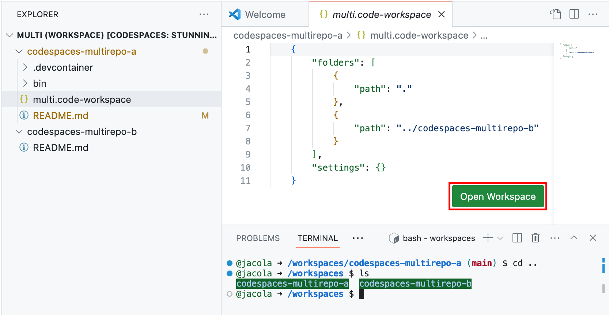

# Codespace for multiple repositories example / 複数リポジトリの管理に単一のCodespacesの例

### Configuration
1. Define access requirements to the other repositories in your `devcontainer.json`.
2. Clone repositories using HTTPS. (Ex: `clone-repos.sh`) If you use SSH, it will fail because the script will hang when prompted, `Are you sure you want to continue connecting (yes/no/[fingerprint])?` 
3. Add repository folders to `multi.code-workspace`.

### Usage
- Codespaceの起動後、`multi.code-workspace`を選択、右下の緑「Open Workspace」ボタンを押下。

### 設定方法
1. `devcontainer.json`にて他レポのアクセス権限を定義。
2. HTTPSでレポをクロン。 (例: `clone-repos.sh`) SSHを利用した場合には、`Are you sure you want to continue connecting (yes/no/[fingerprint])?` を聞かれ、失敗。
3. `multi.code-workspace`にレポのフォルダーを定義。

### 使い方
- Once the codespace is open, select the `multi.code-workspace` and click the green "Open Workspace" button.

### References （参考）
- [Codespaces for multi-repository and monorepo scenarios](https://github.blog/2022-04-20-codespaces-multi-repository-monorepo-scenarios/)
- [Managing access to other repositories within your codespace](https://docs.github.com/en/codespaces/managing-your-codespaces/managing-repository-access-for-your-codespaces)